<!-- ⚡ Custom animated hero -->
<p align="center">
  
</p>

<p align="center">
  
</p>

## 🧑‍💻 About

```typescript
const suren = {
  role: "Senior Backend Engineer @ Constant Technologies",
  experience: "15+ years",
  focus: ["Redis infrastructure", "distributed architectures", "developer tooling"],
  stack: ["TypeScript", "Node.js", "NestJS", "PostgreSQL", "Kafka", "ClickHouse"],
  openSource: {
    project: "NestJS RedisX",
    what: "modular Redis toolkit for NestJS with plugin architecture",
    scale: "2,200+ tests · ~88% coverage · MIT",
  },
} satisfies Engineer;
```

## ⚡ NestJS RedisX

<p align="center">
  <a href="https://github.com/nestjs-redisx/nestjs-redisx">
    
  </a>
</p>

<p align="center">
  
  
  
  
</p>

<p align="center">
  
  
  
</p>

<div align="center">

| | |
|---|---|
| 🗄️ **L1+L2 caching** - SWR & anti-stampede protection | 🔒 **Distributed locks** - with auto-renew |
| 🚦 **Rate limiting** - fixed / sliding / token bucket | ♻️ **Idempotency** - dedup + response replay |
| 🌊 **Redis Streams** - consumer groups & DLQ | 📈 **Observability** - Prometheus + OpenTelemetry |

**…and more** - the roadmap doesn't stop here 🚧

</div>

## ⚙️ Tech Stack

<div align="center">

**Languages & Runtime**


**Frameworks & APIs**


**Data & Messaging**


   

**Infrastructure & Observability**


 

**Security & Pentest**


 

**Also worked with**


</div>

## 📊 GitHub Activity

<div align="center">
  
</div>

<div align="center">
  
</div>

<div align="center">
  <picture>
    <source media="(prefers-color-scheme: dark)" srcset="https://raw.githubusercontent.com/sur-ser/sur-ser/output/github-snake-dark.svg"/>
    <source media="(prefers-color-scheme: light)" srcset="https://raw.githubusercontent.com/sur-ser/sur-ser/output/github-snake.svg"/>
    
  </picture>
</div>

## 🤝 Connect

<p align="center">
  <a href="https://github.com/nestjs-redisx/nestjs-redisx">
    
  </a>
</p>

<p align="center">
  
</p>

<p align="center">
  
</p>
